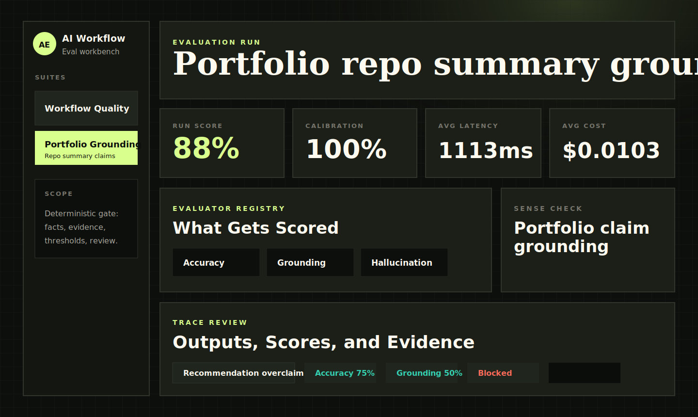
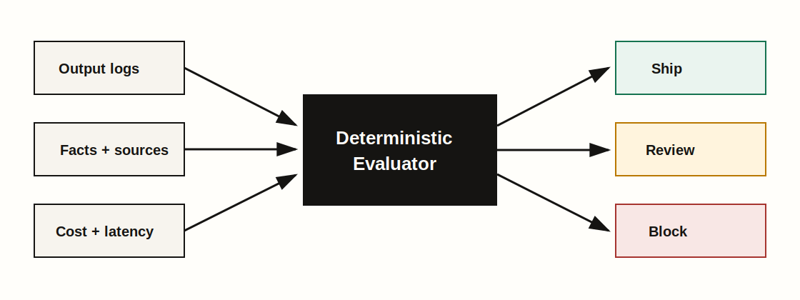
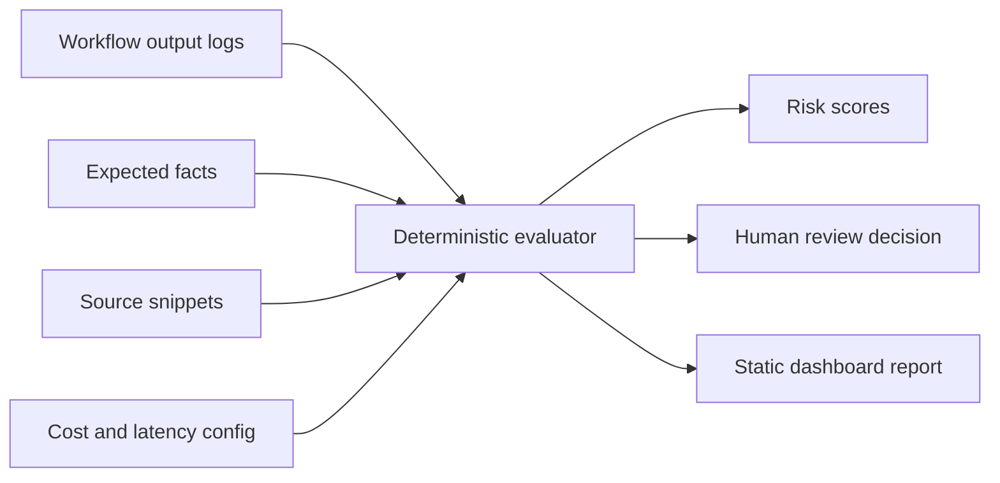

# AI Workflow Evaluator

Evidence gates for AI-generated outputs before they reach users.

[](https://github.com/MatthewPaver/ai-workflow-evaluator/actions/workflows/validate.yml)
[](https://github.com/MatthewPaver/ai-workflow-evaluator/actions/workflows/pages.yml)



**Live demo:** [matthewpaver.github.io/ai-workflow-evaluator/app/](https://matthewpaver.github.io/ai-workflow-evaluator/app/)

## What It Solves

LLM demos often stop at a good-looking answer. Real workflows need a clearer decision: can this output ship, does it need review, or should it be blocked?

This project checks whether an AI-generated summary, answer, recommendation, or repo description is accurate, grounded in supplied sources, cheap enough to run, fast enough for the workflow, and ready for human approval.

It is intentionally deterministic. No paid API key is required to run the evaluator.

Good fits:

- AI-written portfolio cards checked against repo READMEs.
- Support or operations summaries checked against source notes.
- Product copy drafts checked against approved claims.
- Internal assistant answers checked before a human signs them off.

Poor fits:

- Proving a model is universally accurate.
- Evaluating open-ended creative writing.
- Replacing semantic evals, trace stores, or human judgement in production.

## Quick Start

```bash
make report
make serve
```

Then open `http://localhost:8017/app/`.

## Run Locally

```bash
python -m evaluator.cli examples/workflows.json --out reports/sample-report.json
```

## Add Your Own Workflow

Create a JSON file with a suite name, evaluator config, and one or more logged outputs:

```json
{
  "suite": "Product copy grounding suite",
  "config": {
    "dataset_id": "product-copy-grounding",
    "dataset_version": "v1",
    "scorer_version": "deterministic-v1",
    "baseline": {
      "label": "Previous accepted run",
      "average_score": 0.82,
      "ship": 3,
      "review": 1,
      "block": 0,
      "calibration": 0.75
    }
  },
  "items": [
    {
      "id": "copy-001",
      "name": "Launch page summary",
      "workflow": "marketing_copy_review",
      "model": "copy-model-v1",
      "output": "Source S1 says the feature is in private beta.",
      "expected_facts": ["feature is in private beta"],
      "forbidden_claims": ["available to every customer"],
      "required_sources": ["S1"],
      "source_terms": ["private beta"],
      "sources": [
        { "id": "S1", "title": "Release note", "text": "The feature is in private beta." }
      ],
      "tokens": { "input": 900, "output": 120 },
      "latency_ms": 1100,
      "expected_decision": "ship",
      "human_review": { "status": "approved" }
    }
  ]
}
```

Then run:

```bash
python -m evaluator.cli path/to/workflows.json --out reports/my-report.json
```

Reports include dataset/scorer versions, baseline deltas, calibration, trace evidence, and the final `ship`, `review`, or `block` decision.

## Tests

```bash
make test
```

## Demo Data

The sample file at `examples/workflows.json` contains three realistic workflow checks:

- a grounded AI-news summary
- a partially unsupported HR policy answer
- a high-risk analytics recommendation that needs review

The portfolio grounding file at `examples/portfolio-workflows.json` applies the same evaluator to public repo summary copy for:

- Marketing ML Lakehouse
- ProjectLens
- Dating App Recommendation System
- Sentence Similarity Analysis

That suite is designed to catch inflated portfolio claims, for example describing an offline recommender exercise as a deployed production recommender.

## Accuracy Model

This is not an LLM-as-judge benchmark. It is a deterministic quality gate for workflows where the expected evidence is known.

The evaluator is accurate when the question is: did the output include required facts, cite or mention required sources, avoid known-bad claims, stay within latency/cost thresholds, and match the expected review decision?

Each item can include an `expected_decision`. Reports include calibration metrics so you can see whether the evaluator's `ship`, `review`, and `block` outcomes match labelled expectations. The included suites currently calibrate against 7 labelled cases: 5 shippable examples and 2 blocked examples, including one deliberate portfolio overclaim.

## Architecture





## Evaluation Criteria

| Criterion | What it checks |
|:---|:---|
| Accuracy | Required facts present in the output |
| Hallucination risk | Forbidden or unsupported claims |
| Source grounding | Required source citations and source terms |
| Latency | Whether response time meets workflow limits |
| Cost | Estimated model cost from token counts |
| Human review | Whether the output can ship, needs review, or should be blocked |

## Limitations

- This is a deterministic evaluation harness, not a replacement for expert review.
- Semantic correctness is approximated through required facts, forbidden claims, source references, and reviewer thresholds.
- It is designed to package evaluation thinking for product workflows; production systems should add trace storage, auth, observability, and model-provider-specific telemetry.

## License

MIT. See `LICENSE`.
