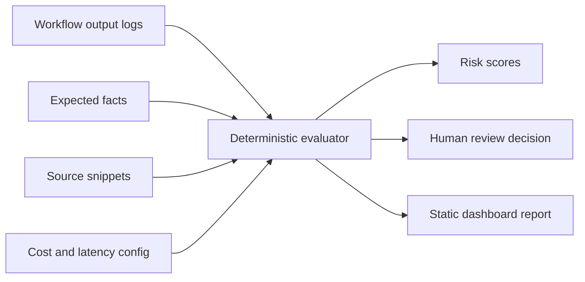

# AI Workflow Evaluator

AI Ops control layer for deciding whether AI work is accurate, grounded, affordable, fast enough, and ready for review.

[](https://github.com/MatthewPaver/ai-workflow-evaluator/actions/workflows/validate.yml)
[](https://github.com/MatthewPaver/ai-workflow-evaluator/actions/workflows/pages.yml)


**Live demo:** [matthewpaver.github.io/ai-workflow-evaluator/app/](https://matthewpaver.github.io/ai-workflow-evaluator/app/)

## What It Solves

LLM demos often stop at a good-looking answer. Real workflows need a clearer decision: can this output ship, does it need review, should it be blocked, or should it be routed to a cheaper/faster/stronger model path?

This project checks whether an AI-generated summary, answer, recommendation, repo description, screenshot summary, PDF answer, product-listing draft, or audio-transcript action list is accurate, grounded in supplied sources, cheap enough to run, fast enough for the workflow, and ready for human approval.

It is intentionally deterministic. No paid API key is required to run the evaluator.

Good fits:

- AI-written portfolio cards checked against repo READMEs.
- Support or operations summaries checked against source notes.
- Product copy drafts checked against approved claims.
- Internal assistant answers checked before a human signs them off.
- Multimodal workflows where screenshots, PDFs, images, or audio change the cost and review path.

Poor fits:

- Proving a model is universally accurate.
- Evaluating open-ended creative writing.
- Replacing semantic evals, trace stores, or human judgement in production.

## Quick Start

```bash
make report
make serve
```

Then open `http://localhost:8017/app/`.

## Run Locally

```bash
python -m evaluator.cli examples/workflows.json --out reports/sample-report.json
```

## Add Your Own Workflow

Create a JSON file with a suite name, evaluator config, and one or more logged outputs:

```json
{
  "suite": "Product copy grounding suite",
  "config": {
    "dataset_id": "product-copy-grounding",
    "dataset_version": "v1",
    "scorer_version": "deterministic-v1",
    "baseline": {
      "label": "Previous accepted run",
      "average_score": 0.82,
      "ship": 3,
      "review": 1,
      "block": 0,
      "calibration": 0.75
    }
  },
  "items": [
    {
      "id": "copy-001",
      "name": "Launch page summary",
      "workflow": "marketing_copy_review",
      "model": "copy-model-v1",
      "output": "Source S1 says the feature is in private beta.",
      "expected_facts": ["feature is in private beta"],
      "forbidden_claims": ["available to every customer"],
      "required_sources": ["S1"],
      "source_terms": ["private beta"],
      "sources": [
        { "id": "S1", "title": "Release note", "text": "The feature is in private beta." }
      ],
      "tokens": { "input": 900, "output": 120 },
      "latency_ms": 1100,
      "expected_decision": "ship",
      "human_review": { "status": "approved" }
    }
  ]
}
```

Then run:

```bash
python -m evaluator.cli path/to/workflows.json --out reports/my-report.json
```

Reports include dataset/scorer versions, baseline deltas, calibration, trace evidence, and the final `ship`, `review`, or `block` decision.

## Measurable Results

The evaluator now writes a `measurable_results` block into every report. That gives you numbers to inspect or quote instead of relying on a dashboard impression.

Current checked suites:

| Suite | Labelled accuracy | Score delta | Calibration delta | Decisions | Cost exposure |
|:---|---:|---:|---:|:---|---:|
| Workflow Quality | 100% (3/3) | +5.9 pts | +33.0 pts | 2 ship · 0 review · 1 block | $0.00/month |
| Portfolio Grounding | 100% (4/4) | +14.0 pts | +25.0 pts | 3 ship · 0 review · 1 block | $0.00/month |
| AI Ops Multimodal | 100% (4/4) | +7.8 pts | +25.0 pts | 2 ship · 1 review · 1 block | $75.87/month |

The portfolio suite catches the deliberate recommender overclaim and blocks it. The AI Ops suite routes four multimodal workflows across standard review, human review, input compression, and block/rewrite paths.

## AI Ops Controls

Each workflow can now declare:

- input modalities: text, screenshots, images, PDF pages, and audio minutes
- token usage and per-modality pricing
- monthly run volume for spend projection
- risk level for routing decisions
- latency and cost thresholds

The evaluator reports:

- token cost and multimodal cost per run
- projected monthly cost
- model-routing recommendation
- route reason
- deterministic review-agent findings

The included prices are configurable demonstration rates, not a live provider billing feed. Replace them with the current rates from your chosen model provider before using the numbers for planning.

Example routes include:

| Route | Meaning |
|:---|:---|
| `small_model_auto_gate` | Low-risk, grounded, cheap, and fast enough for automated gating. |
| `standard_model_review_gate` | Normal quality gate before shipping. |
| `strong_model_plus_human_review` | High-risk or unapproved workflow needs stronger reasoning and sign-off. |
| `retrieve_more_context` | Evidence coverage is too weak. |
| `compress_inputs_or_use_cheaper_model` | Multimodal spend is too high for the threshold. |
| `async_queue_or_faster_model` | Latency is too high for an interactive workflow. |
| `block_or_rewrite` | Policy, overclaim, or quality issue means the output should not ship. |

## Tests

```bash
make test
```

## Demo Data

The sample file at `examples/workflows.json` contains three realistic workflow checks:

- a grounded AI-news summary
- a partially unsupported HR policy answer
- a high-risk analytics recommendation that needs review

The portfolio grounding file at `examples/portfolio-workflows.json` applies the same evaluator to public repo summary copy for:

- Marketing ML Lakehouse
- ProjectLens
- Dating App Recommendation System
- Sentence Similarity Analysis

That suite is designed to catch inflated portfolio claims, for example describing an offline recommender exercise as a deployed production recommender.

The AI Ops file at `examples/ai-ops-workflows.json` adds four multimodal workflow checks:

- screenshot to support-ticket summary
- PDF policy answer
- audio transcript to action list
- product image listing draft

## Accuracy Model

This is not an LLM-as-judge benchmark. It is a deterministic quality gate for workflows where the expected evidence is known.

The evaluator is accurate when the question is: did the output include required facts, cite or mention required sources, avoid known-bad claims, stay within latency/cost thresholds, and match the expected review decision?

Each item can include an `expected_decision`. Reports include calibration metrics so you can see whether the evaluator's `ship`, `review`, and `block` outcomes match labelled expectations. The included suites currently calibrate against 11 labelled cases across workflow quality, portfolio grounding, and multimodal AI Ops checks.

## Architecture




## Evaluation Criteria

| Criterion | What it checks |
|:---|:---|
| Accuracy | Required facts present in the output |
| Hallucination risk | Forbidden or unsupported claims |
| Source grounding | Required source citations and source terms |
| Latency | Whether response time meets workflow limits |
| Cost | Estimated token and multimodal cost |
| Human review | Whether the output can ship, needs review, or should be blocked |
| Routing | Whether to use a small model, stronger model, human review, context retrieval, compression, async queueing, or block/rewrite |

## Specialist Review Stages

Every evaluated item includes 14 deterministic checks and 8 named review stages:

- `reviewer_agent` checks the human-review state against the final decision.
- `source_grounding_agent` checks citations and required source coverage.
- `hallucination_agent` checks blocked claims.
- `cost_agent` checks token-cost thresholds.
- `latency_agent` checks workflow timing.
- `policy_agent` escalates high-severity issues.
- `model_router_agent` recommends the operating path for the workflow.
- `multimodal_cost_agent` checks whether multimodal spend needs review before scale-up.

These are named review stages rather than autonomous chat agents, so the quality gate stays reproducible and easy to inspect.

## Limitations

- This is a deterministic evaluation harness, not a replacement for expert review.
- Semantic correctness is approximated through required facts, forbidden claims, source references, and reviewer thresholds.
- It is designed to package evaluation thinking for product workflows; production systems should add trace storage, auth, observability, and model-provider-specific telemetry.

## License

MIT. See `LICENSE`.
