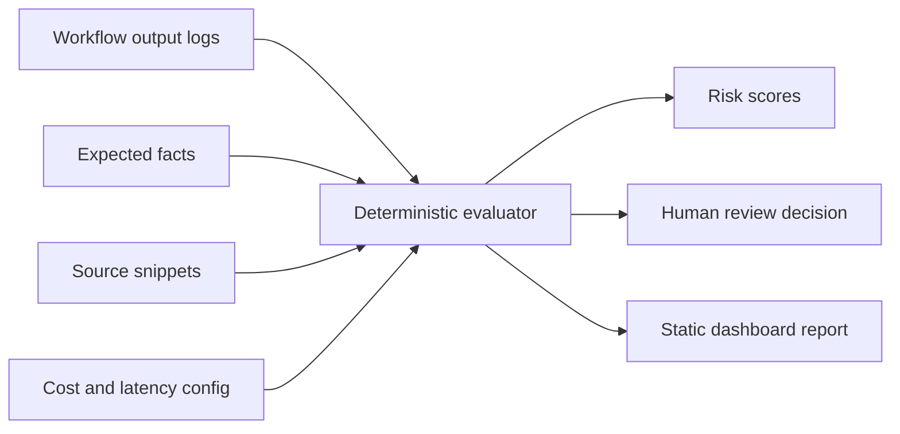

# AI Workflow Evaluator

Deterministic evaluation for LLM outputs before they reach users.

[](https://github.com/MatthewPaver/ai-workflow-evaluator/actions/workflows/validate.yml)
[](https://github.com/MatthewPaver/ai-workflow-evaluator/actions/workflows/pages.yml)


**Live demo:** [matthewpaver.github.io/ai-workflow-evaluator/app/](https://matthewpaver.github.io/ai-workflow-evaluator/app/)

## What It Solves

LLM demos often stop at a good-looking answer. This project checks whether an output is accurate, grounded in supplied sources, cheap enough to run, fast enough for the workflow, and ready for human approval.

It is intentionally deterministic. No paid API key is required to run the evaluator.

## Quick Start

```bash
make report
make serve
```

Then open `http://localhost:8017/app/`.

## Run Locally

```bash
python -m evaluator.cli examples/workflows.json --out reports/sample-report.json
```

## Tests

```bash
make test
```

## Demo Data

The sample file at `examples/workflows.json` contains three realistic workflow checks:

- a grounded AI-news summary
- a partially unsupported HR policy answer
- a high-risk analytics recommendation that needs review

## Architecture




## Evaluation Criteria

| Criterion | What it checks |
|:---|:---|
| Accuracy | Required facts present in the output |
| Hallucination risk | Forbidden or unsupported claims |
| Source grounding | Required source citations and source terms |
| Latency | Whether response time meets workflow limits |
| Cost | Estimated model cost from token counts |
| Human review | Whether the output can ship, needs review, or should be blocked |

## Limitations

- This is a deterministic evaluation harness, not a replacement for expert review.
- Semantic correctness is approximated through required facts, forbidden claims, source references, and reviewer thresholds.
- It is designed to package evaluation thinking for product workflows; production systems should add trace storage, auth, observability, and model-provider-specific telemetry.

## License

MIT. See `LICENSE`.
